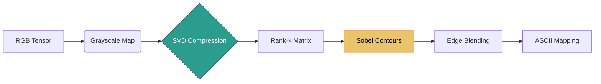

<div align="center">

# 🌌 ASCIIfy Core Engine
### *The Intersection of Linear Algebra and ASCII Art*

[](https://www.python.org/)
[](https://numpy.org/)
[](https://flask.palletsprojects.com/)
[](https://opencv.org/)

**ASCIIfy** is not your standard "brightness-to-character" script. It is a high-performance engine that reconstructs visual data using pure linear algebraic transformations. By treating video feeds as dynamic matrices, it performs low-rank approximations and gradient analysis to produce cinematic, edge-aware terminal art at **30+ FPS**.

</div>

---

## 🚀 Two Powerful Frontends

| 💻 Native Desktop (`desktop_app.py`) | 🌐 Web Interface (`app.py`) |
| :--- | :--- |
| **High Performance**: Direct OpenCV camera access. | **Modern Design**: Premium Glassmorphism UI. |
| **Real-time Controls**: 7+ dynamic sliders for live tuning. | **Drag & Drop**: Analyze static images & webcam. |
| **Ultra Low Latency**: C++ accelerated NumPy logic. | **Shareable**: Clean HTML `<pre>` block outputs. |

---

## 🧪 Mathematical Pipeline
Unlike basic filters, the ASCIIfy pipeline operates on the spectral and spatial derivatives of the image matrix.



### 1. Singular Value Decomposition (SVD)
Every frame is factored into $A = U \Sigma V^T$. By performing **Low-Rank Approximation**, we forcefully strip out high-frequency noise.
> **Why?** It ensures that only the most structurally significant data flows into the renderer, creating a "clean" artistic look.

### 2. Sobel Vectorized Convolution
We compute the mathematical gradient (partial derivatives) of the pixel intensities:
- **Magnitude:** $M = \sqrt{G_x^2 + G_y^2}$ (Defines the edge strength)
- **Direction:** $\theta = \operatorname{arctan2}(G_y, G_x)$ (Determines the character orientation)

The engine automatically segments $\theta$ into 4 "buckets" to choose the perfect structural character (`|`, `\`, `_`, `/`), making structures like faces and silhouettes pop with physical clarity.

---

## 🛠️ Controls & Interaction
The Native App provides a "Hacker-style" Control Window for on-the-fly manipulation:

- **SVD Rank Slider**: Dial in the level of detail from abstract geometry to sharp realism.
- **Edge Weight**: Amplify the directional contours of the image.
- **Color Filters**: Toggle between **Matrix Green**, **Cyber Orange**, **True Color**, and **Inverted B&W**.
- **Custom Character Set**: Press `c` to instantly inject your own character ramp.

---

## 📦 Getting Started

### Prerequisites
- Python 3.8+
- Webcam (for Desktop/Webcam modes)

### Installation
```bash
# Clone the repository
git clone https://github.com/your-repo/asciify.git
cd asciify

# Install dependencies
pip install -r requirements.txt
```

### Usage
- **Run the Web App:** `python app.py` (Visit `http://localhost:5000`)
- **Run the Native App:** `python desktop_app.py`

---

## 📚 Technical Documentation
For those looking to dive into the raw math and optimization tricks:
- 📖 [**Mathematics Explained**](./MATH-EXPLAINED.md) — SVD and Sobel math breakdown.
- 📺 [**Video Pipeline**](./video.md) — How we handle buffers and high-speed frames.
- ⚡ [**Example Flow**](./EXAMPLE-FLOW.md) — A step-by-step trace of a single pixel's journey.

<p align="center">
  Built with ❤️ using pure Linear Algebra.
</p>

