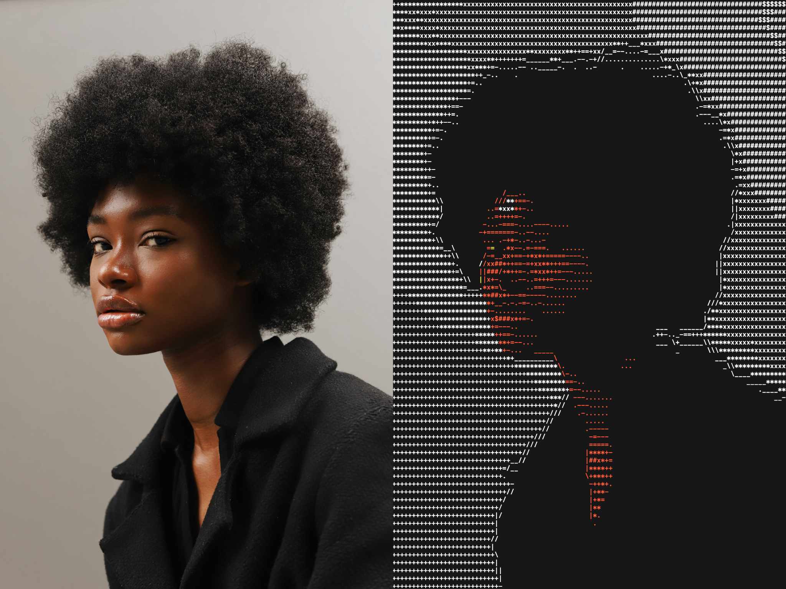
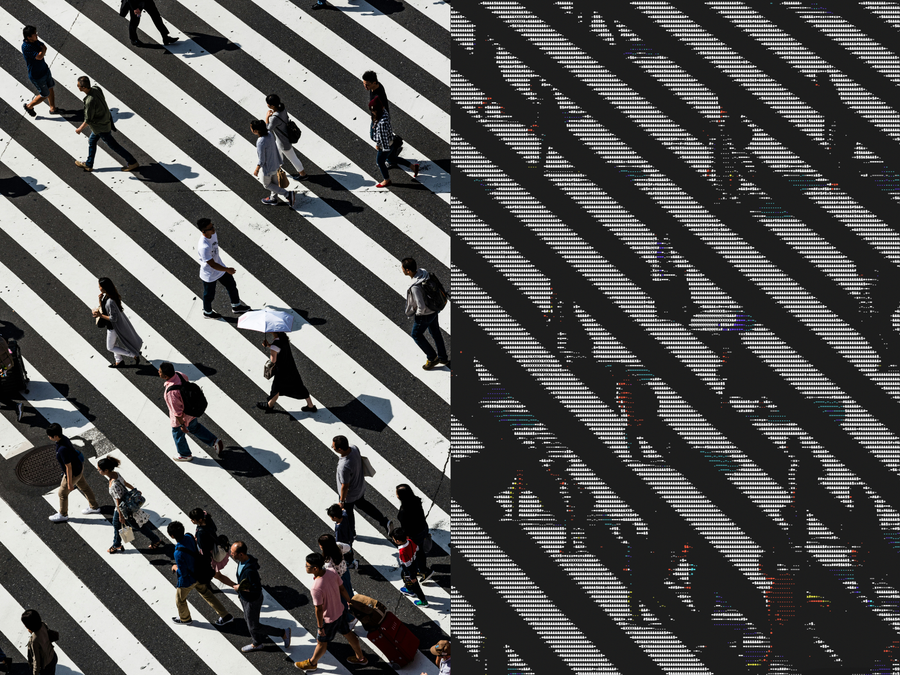

# ASCII View

A command-line tool that displays images as colorized ASCII art in the terminal.
Rewritten in Python with a Linear Algebra pipeline for academic purposes.



## Features
- **Multi-format support**: Supports JPEG, PNG, BMP, and other common image formats via Pillow
- **Color terminal output**: Uses ANSI 24-bit color codes
- **Intelligent resizing**: Scales images to fit the terminal's constrained dimensions while maintaining aspect ratio
- **Terminal-optimized**: Adjusts for typical terminal font aspect ratios (characters are taller than they are wide)
- **Edge enhancement**: Uses Sobel filtering with manual convolution
- **Linear Algebra pipeline**: SVD compression and matrix projection using numpy

## Building

This project can be built with Make:
```bash
# Create executable wrapper
make

# Run directly with Python
make run
```

To install dependencies:
```bash
make install
```

To clean build artifacts:
```bash
make clean
```

Requirements:
- Python 3.8+
- Pillow
- NumPy

## Usage

```bash
./ascii-view <path/to/image> [OPTIONS]
```

### Options

- `-mw <width>`: Maximum width in characters (default: terminal width)
- `-mh <height>`: Maximum height in characters (default: terminal height)
- `-et <threshold>`: Edge enhancement threshold, range: 0.0 - 1.0 (default: 0.5)
- `-cr <ratio>`: Height-to-width ratio for characters (default: 2.0)
- `-r <rank>`: SVD rank for compression (default: 50)

### Examples

```bash
# Basic usage with default dimensions
./ascii-view examples/puffin.jpg

# Specify custom dimensions
./ascii-view examples/waterfall.jpg -mw 120 -mh 60

# Specify edge threshold
./ascii-view examples/black-and-white.jpg -et 2.5

# Specify character aspect ratio
./ascii-view examples/cacti.jpg -cr 1.7
```

The images in the `examples` directory are via [Unsplash](https://unsplash.com)

### Suggestions for getting good looking results
1. If you make your font size smaller, you can make the pictures larger
2. The results are limited by your terminal's colour scheme
3. If you squint your eyes the images look great!



## How It Works

1. **Image loading**: Uses Pillow to load various image formats, converts to RGB
2. **Aspect ratio correction**: Accounts for terminal character dimensions (typically ~2:1 height to width ratio[^1])
3. **Grayscale conversion**: Uses luminance formula: `I = 0.299R + 0.587G + 0.114B`
4. **SVD Compression**: Performs singular value decomposition using `numpy.linalg.svd`, reduces rank for compression
5. **Matrix Projection**: Projects onto reduced subspace, calculates reconstruction error
6. **Sobel Edge Detection**: Manual convolution with kernels:
   ```
   Gx = [[-1, 0, 1], [-2, 0, 2], [-1, 0, 1]]
   Gy = [[-1,-2,-1], [ 0, 0, 0], [ 1, 2, 1]]
   ```
7. **Edge Combination**: `combined = 0.7 * grayscale + 0.3 * edges`
8. **ASCII mapping**: Maps brightness to characters: ` .:-=+*#%@`
9. **Color output**: ANSI 24-bit escape codes for per-pixel RGB color

[^1]: Some terminals support the ability to extract the exact font ratio, but others don't. For the time being we assume a 2:1 ratio, with ability to change it through the `-cr` option.
